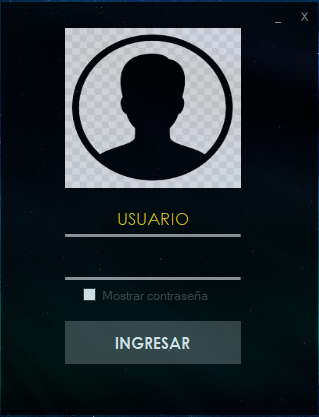
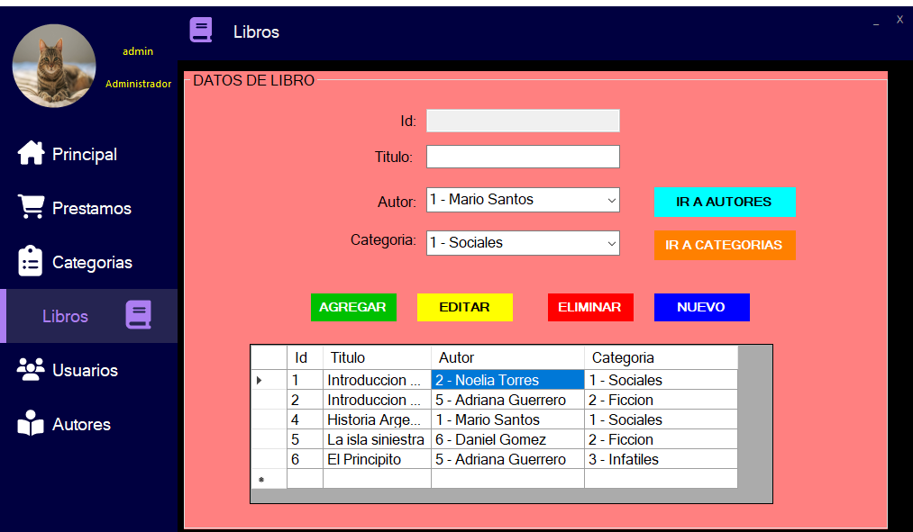
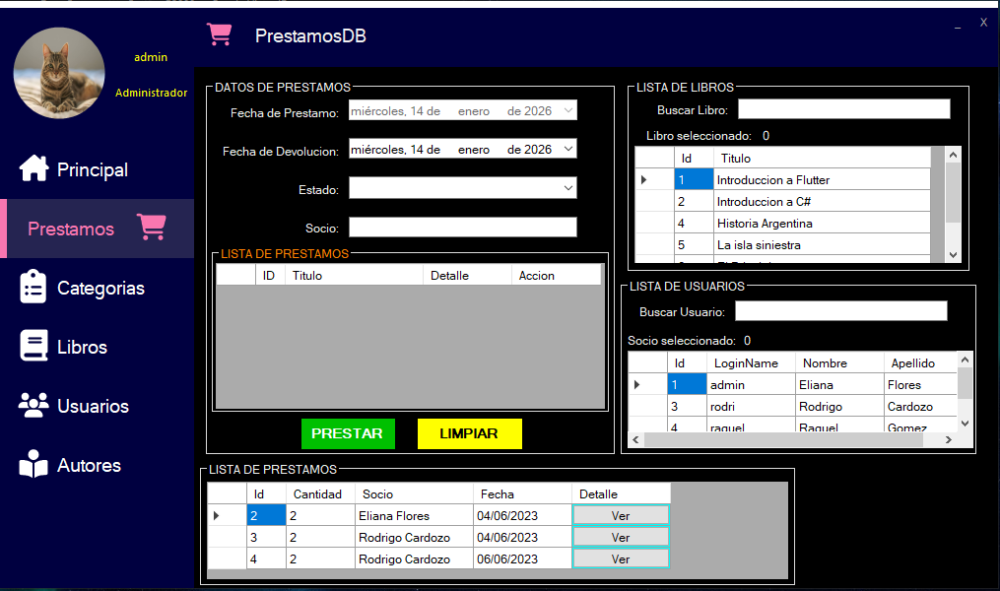
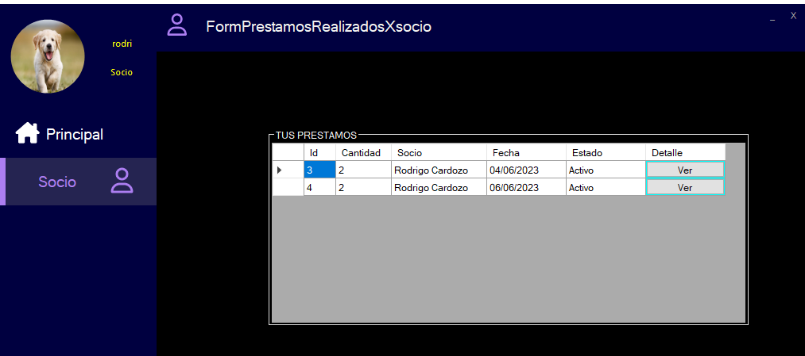

# 📚 Library Management System

Desktop application built with **C# and .NET Framework** to manage a library with **user roles, loans, categories, authors and reports**.

This system allows an administrator to manage all the library data and a member (socio) to consult and print their own loans.

---

## 🧩 Main Features

### 🔐 Authentication
The system includes a login with two user roles:
- **Administrator**
- **Member (Socio)**

Each role has access to different functionalities.

---

### 👨‍💼 Administrator Features

Administrators have access to the full system:

- **Dashboard**
  - Main system screen

- **Loans Management**
  - Create a loan for one or more books
  - Assign loans to registered members
  - View loan details
  - Return borrowed books

- **Categories**
  - Create, edit and delete book categories

- **Books**
  - Register new books
  - Assign **author** and **category** to each book
  - Edit and delete books

- **Users**
  - Manage system users
  - Register administrators and members

- **Authors**
  - Create, edit and delete authors used by books

---

### 👤 Member (Socio) Features

Members have limited access focused on their own activity:

- **My Loans**
  - View all books borrowed by the member
  - See loan details
  - **Print loan ticket**

---

## 🛠 Technologies

- **C#**
- **.NET Framework**
- **Windows Forms**
- **SQL Server**
- **Visual Studio**

---

## 🗂 System Structure

The application follows a layered approach:

- **Presentation Layer** (Windows Forms UI)
- **Business Logic Layer**
- **Data Access Layer (SQL Server)**

This structure helps keep the code clean, organized and easy to maintain.

---

## 📸 Screenshots

### 🔐 Login
 
### 📚 Books Management

### 🔄 Loans

### 👤 Member View

---

## 🚀 How to Run

1. Open the solution in **Visual Studio**
2. Restore the SQL Server database
3. Update the connection string if needed
4. Run the project

---

## 🎯 Purpose

This project was developed as part of a university course to practice:
- Object-Oriented Programming
- Database-driven applications
- User roles and permissions
- Real-world business logic
